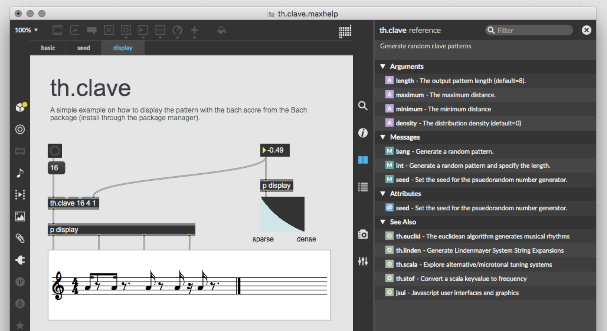

# th.clave

Generate random clave patterns for algorithmic composition. Outputs a binary list as rhythm, where 1's represent onsets and 0's represent rests. A `bang` results in a new random list, an `int` adjust the output to the length of that size. Optional arguments on the cold inlets set the shortest and maximum distance between onsets to choose from. Last optional argument is the random distribution between `-1` and `1`, this can be seen as a "density" option where values closer to -1 will result in rhythms that favor large distance between the onsets and a value closer to 1 will result in more dense rhythms with less 0's.



**arguments**

- `length` - the length of the rhythm list to output (default=8)
- `max distance` - the maximum distance between 2 onsets. For example `4` = `1 0 0 0 1`. (default=3)
- `min distance` - the minimum distance between 2 onsets. For example `1` = `1 1`. (default=2)
- `density` - the random distribution curve between -1 and 1. Lower values favor longer distances, larger value favors shorter distances. (default=0)

**attributes**

- `seed` - set the seed for the psuedorandom number generator

## Install

```
1. download zip
2. unzip and place in Max Library (on MacOS ~/Documents/Max 8/Library)
3. restart Max8, open a new patcher and create the object
```

```
1. open terminal
2. $ cd ~/Documents/Max\ 8/Library
3. $ git clone https://github.com/tmhglnd/th.clave.git
4. restart Max8, open a new patcher and create the object
```

# License

MIT License

This program is distributed in the hope that it will be useful,
but WITHOUT ANY WARRANTY; without even the implied warranty of
MERCHANTABILITY or FITNESS FOR A PARTICULAR PURPOSE. See the
GNU General Public License for more details.